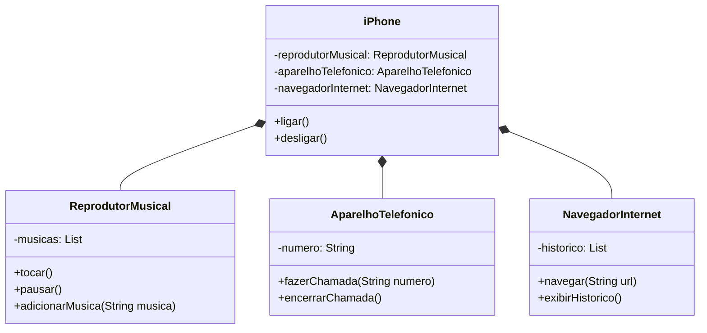

# Desafio de Orientação a Objetos - DIO

## Descrição
O desafio consiste em modelar uma representação do primeiro modelo de iPhone, lançado em 2007, utilizando a linguagem de programação Java. 

Neste projeto, o iPhone é modelado como uma classe que compõe várias funcionalidades essenciais, cada uma representada por suas próprias classes: ReprodutorMusical, AparelhoTelefonico e NavegadorInternet. Cada uma dessas classes possui atributos e métodos próprios, demonstrando encapsulamento. As associações e composições mostram como as diferentes partes do sistema interagem e dependem umas das outras.

Implementar esses conceitos em um diagrama UML ajuda a visualizar e estruturar o código de maneira eficiente, mantendo a organização e a modularidade, fundamentais na POO.

## Modelo UML

